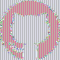
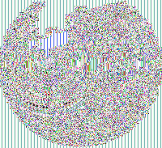
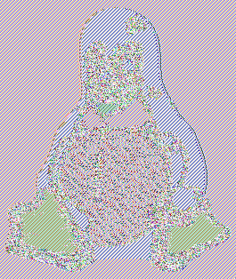

visualmoo
=========

visualmoo is a silly small program to create images to illustrate that using the [ECB mode-of-operation][ecbmoo] is typically a Bad Idea.

As discussed elsewhere, the disadvantage of ECB is that identical plaintext blocks are encrypted into identical ciphertext blocks, potentially revealing a lot of structure. One nice way to visually demonstrate this is to encrypt a bitmap image with large areas of uniform colour. On the [wikipedia page describing ECB][ecbmoo] a Tux image is used. This little program visualmoo lets you create similar images. And just to be clear, although this program reads and writes PNG files, the encryption is of course applied to the _uncompressed_ bitmap data.

Building
--------

visualmoo is written in [Go][golang], has no external dependencies besides Go's standard library, and consists of a single source file. Therefore compiling consists of a simple

    go build .

This results in a binary visualmoo

Usage
-----

To run simply do

    ./visualmoo <inputimage> <outputimage>

The input image can either be a PNG or a JPEG file, the output image is always a PNG file.

There are some command-line options, to see which:

    ./visualmoo -h

    visualmoo - illustrate ECB badness through images.
    Usage of ./visualmoo:
      -key string
        	Key to use, either 'random' (default) or a hexadecimal string representing 16, 24, or 32 bytes. (default "random")
      -mode string
        	mode of operation to use, options are: ECB and CBC (default "ECB")
      -skipalpha
        	ignore (skip) the alpha channel

[ecbmoo]: https://en.wikipedia.org/wiki/Block_cipher_mode_of_operation#Electronic_Codebook_.28ECB.29
[golang]: https://golang.org/

Example output
--------------

